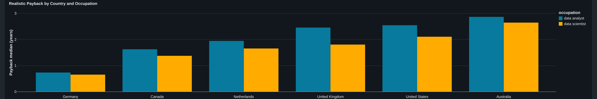
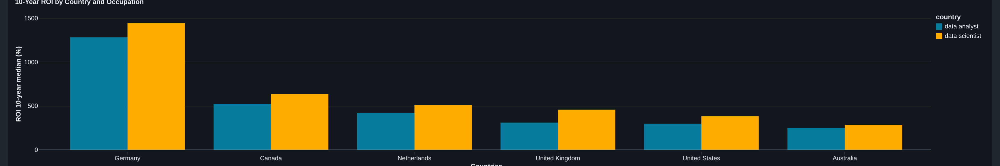
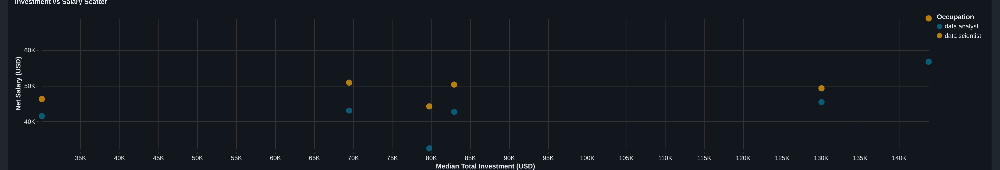
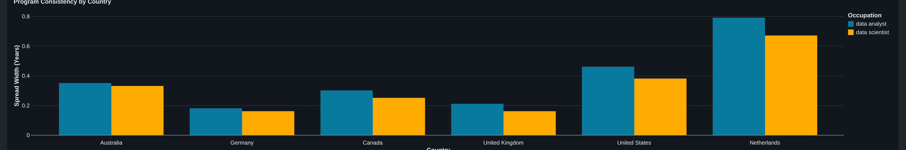

# International STEM Master's ROI Analysis

A data analytics project measuring the financial return on investment of international STEM master's degrees across six countries, for two data-related occupations.

**Research question:** Which major study-abroad destinations offer the best financial return for international master's students in data-related STEM fields?

---

## Scope

The population is international (non-EU/non-domestic) students pursuing a master's degree. Countries covered: United States, Canada, United Kingdom, Australia, Germany, Netherlands. Occupations covered: Data Analyst, Data Scientist.

Ten programs were sampled per country, 60 total. These are popular, standard choices for international students, not just the top-ranked universities, and all are eligible for international students to apply to.

This is a financial ROI analysis only. Quality of life and other subjective factors were cut on purpose, to keep the project narrow enough to actually finish as a first portfolio piece.

---

## Methodology

### Tuition and living cost data

Collected per program from official university sources, converted to total program cost in USD (not annual figures). Summarized using median and IQR rather than simple averages, since a handful of programs in each country cost noticeably more than the rest. An average gets skewed by those outliers in a way the median doesn't.

### Salary data

"Entry-level" salary is defined per country, using whatever concept that country's own labor-market data actually supports, rather than forcing one definition (like "25th percentile") everywhere, even where it wasn't available.

| Country | Entry-level definition | Source |
|---|---|---|
| United States | 25th percentile wage | BLS OEWS (May 2025) |
| Canada | Job Bank "Low" wage | Job Bank / Government of Canada |
| United Kingdom | Home Office "new entrant" rate | UK gov.uk Skilled Worker visa going rates (ASHE-derived) |
| Germany | Lower quartile | Entgeltatlas, Bundesagentur für Arbeit (2025) |
| Australia | Graduate/entry-level, two different sources per role | Hays Australia salary guide (Data Analyst); multi-source-aggregated recruitment guide (Data Scientist). Non-government, see Challenges |
| Netherlands | Junior (0-2 yrs) salary | Nationale Beroepengids. Non-government, see Challenges |

Tax is calculated as federal/national tax plus mandatory payroll contributions only (FICA in the US, CPP/EI in Canada, National Insurance in the UK). State and provincial tax are left out everywhere they vary a lot by region, since programs are spread across many regions within each country and one regional rate wouldn't represent the country fairly.

### ROI formula

Two metrics get computed for every program-occupation combination.

Payback period, in years:
```
Basic payback      = Total tuition / Annual net salary
Realistic payback  = (Total tuition + Total living cost) / Annual net salary
```

Cumulative ROI, in percent, at 5 and 10 years post-graduation:
```
N-year ROI = ((N × Annual net salary) - Total investment) / Total investment × 100
```

Each country has 10 sampled programs, so results get summarized as median plus the 25th-75th percentile (IQR) across those programs, not a single country-level average. That shows how much the outcome depends on which specific program a student picks, instead of hiding it behind one number.

### Employment rate, dropped

An employment-rate variable was originally planned as a multiplier on expected earnings. It got dropped once the data proved impossible to source consistently. The US has no government study of international-student outcomes comparable to Canada's StatCan National Graduates Survey, and the figures that were available mixed incompatible populations (international vs. domestic, STEM vs. all fields). Rather than force in inconsistent numbers, this got documented as a scope limitation instead. Payback and ROI figures assume continuous employment in the target occupation from graduation onward.

---

## Key findings

Ranked by median realistic payback period, fastest to slowest:

| Rank | Country | Realistic payback (median) |
|---|---|---|
| 1 | Germany | ~0.65-0.73 years |
| 2 | Canada | ~1.37-1.62 years |
| 3 | Netherlands | ~1.65-1.94 years |
| 4 | United Kingdom | ~1.80-2.45 years |
| 5 | United States | ~2.10-2.54 years |
| 6 | Australia | ~2.64-2.86 years |

Occupation matters almost as much as country. Data Scientist outperforms Data Analyst on payback speed and 10-year ROI in every single country, typically by 3-6 months of payback time and 100-200 percentage points of 10-year ROI.

Germany's lead comes from tuition policy, not salary. Its entry-level pay actually sits mid-pack among the six countries. The free-tuition policy at several public universities is what drives the result.

Canada's number two ranking is earned honestly, with no free tuition involved. It's just a solid balance of moderate cost and moderate-to-strong salary.

Program choice matters far more in some countries than others. The gap between a country's cheapest and most expensive program to pay back ranges from under 2 months (UK, Germany) to nearly 10 months (Netherlands).

The 10-year ROI numbers compound these gaps. Germany sits around 1,280-1,440%, Australia around 250-280%. That reflects a persistent cost-to-earnings difference, not just a head start. Read Germany's ROI% with some caution though, given how close its tuition denominator sits to zero (see Limitations).

---

## Known data limitations

Read this before citing any single number from the project.

Germany's tuition is close to free for most sampled programs. 7 of the 10 have $0 tuition, a real German public-university policy, not missing data. This makes the basic payback metric collapse toward zero and pushes 10-year ROI% into four digits. That's mathematically correct, but it's a reflection of a near-zero denominator, not evidence that a German degree is "10x better." The realistic payback metric, which includes living costs, is the more useful comparison point for Germany.

Australia's salary figures are less certain than the other five countries. They come from two different private sources rather than one consistent source, after an earlier version of this data turned out to have a real problem (see Challenges below for the full story).

The Netherlands' salary and tax figures are estimates, not primary-sourced. CBS publishes wage data by sector and CAO, not by occupation title, so no government wage-lookup tool exists there like the other five countries have. Salary comes from a private careers-guidance site. The tax rate is interpolated, after a conflicting online calculator turned out to be unreliable (see `Graduate_outcomes.xlsx` for detail).

Employment rate isn't modeled at all, for the reasons covered in Methodology above.

Salary is held flat across the payback and ROI horizon. No raises are assumed. That makes payback periods a bit conservative, slightly overstated, compared to reality.

Opportunity cost (income given up while studying) isn't included in total investment. That would push payback periods later, especially for two-year programs, and is a reasonable extension for a future version.

---

## Challenges encountered

Occupation classification wasn't consistent across countries. The US has no BLS code for "Data Analyst" at all, so Operations Research Analysts got used as a proxy. BLS also classifies Business Intelligence Analysts under the same code as Data Scientists, which is why BI Analyst got dropped as a third occupation entirely rather than duplicate the Data Scientist numbers under a different label or mix sourcing standards across occupations. The UK required resolving ambiguity across several candidate SOC codes before landing on the right one. Germany's occupational categories didn't map cleanly to job titles either.

Numbers got pulled from secondary sources more than once when they shouldn't have been. One BLS figure ($85,720 instead of the correct $85,660) traced back to a paraphrasing aggregator site rather than the actual BLS table. A UK source citation pointed to a relay site instead of gov.uk directly. Fixing this meant repeatedly cross-checking against official pages, often via screenshots, since some government wage tools are JavaScript-rendered and can't be fetched directly.

Wage data was suppressed or missing in a couple of places. Australia's government data (ABS, Jobs and Skills Australia) was suppressed for these specific occupations due to small sample size, and the agency was mid-transition to a new classification system with gaps in what was published. The Netherlands had no occupation-level government wage tool at all, since CBS only publishes by sector. Both required falling back to private sources.

A real data error slipped through on the first pass at Australia. The initial version used SEEK Grad, which reported the same salary range for Data Analyst and Data Scientist. This got caught later by questioning why a dashboard chart showed identical bars for both roles. Re-researching found genuinely different numbers, but from two separate sources this time, since even the second round of research turned up wildly disagreeing figures (AUD $57k to $140k for the same role, depending on the source).

Tax calculations varied a lot in complexity by country. The US and UK use straightforward brackets. Germany runs on a continuous progressive formula instead of simple brackets, and the exact 2025 coefficients couldn't be confirmed from a primary source, so the rate got anchored to verified net-salary calculator outputs instead. The Netherlands had two calculators giving conflicting effective rates for the same income, which meant making a judgment call on which one was more mechanically sound.

"Entry-level" meant something different in every country's underlying data: 25th percentile in the US, a "Low" wage with no clean percentile in Canada, a "new entrant" rate in the UK (actually a cleaner definition than a percentile), lower quartile in Germany, junior/0-2yr banding in the Netherlands. Documenting a different definition per country turned out to be more honest than forcing one method everywhere it didn't fit.

Tooling caused some friction too. A Databricks MCP connector kept failing with a "Server URL doesn't match expected format" error that never got resolved. The workaround was writing and testing the SQL locally first, using SQLite as a stand-in, then handing off the finished scripts to run manually in the Databricks SQL editor.

A couple of early dashboard charts needed rework. A payback-vs-ROI scatter plot turned out to be redundant, since ROI% is mathematically derived from payback period and isn't new information. It got replaced with an investment-vs-salary scatter, which shows something genuinely independent. A stacked bar chart also got flagged as misleading, since the top segment's actual value isn't directly readable off the axis, and got switched to grouped bars instead.

---

## Dashboard

Built in Databricks AI/BI Dashboards on top of the `roi_summary` view.









---

## Repository structure

```
├── README.md
├── data/
│   ├── tuition_data.csv
│   └── salary_data.csv
├── sql/
│   ├── staging/
│   │   └── 01_create_and_validate_staging.sql
│   └── analysis/
│       ├── 02_roi_calculations.sql
│       ├── 03_summary_median_iqr.sql
│       └── 04_rankings_window_functions.sql
├── Master_Tuition_Table.xlsx      (source data + validation notes)
├── Graduate_outcomes.xlsx         (salary/tax data + per-row sourcing)
└── ROI_Analysis.xlsx              (Excel version of the full analysis, with live formulas)
```

## How to reproduce this analysis

**Excel version:** open `ROI_Analysis.xlsx`. All four sheets (Tuition_Data, Salary_Data, ROI_Calculations, Summary) use live formulas, so editing the source data recalculates everything downstream automatically.

**SQL / Databricks version:** upload `data/tuition_data.csv` and `data/salary_data.csv` as tables named `tuition_data` and `salary_data` in a Databricks workspace (Catalog, Create table, Upload file). Run the scripts in order: `01_create_and_validate_staging.sql`, then `02_roi_calculations.sql`, then `03_summary_median_iqr.sql`, then `04_rankings_window_functions.sql`. Files 03 and 04 create the views (`roi_calculations`, `roi_summary`) the dashboard is built on.

**Dashboard:** built in Databricks AI/BI Dashboards on top of the `roi_summary` view. Payback comparison, investment-vs-salary scatter, and program-consistency (spread) charts.
